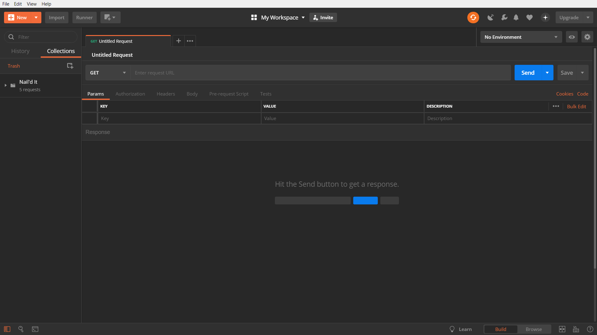
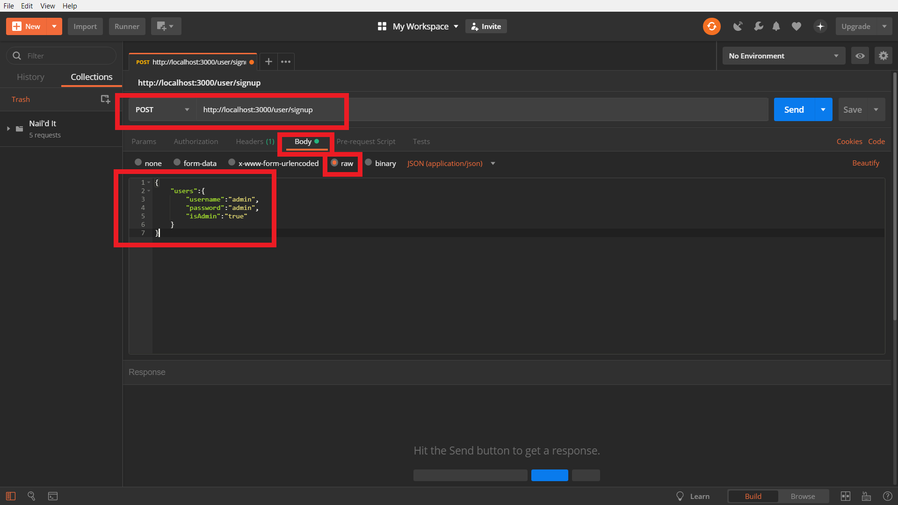

# Table of Contents
0. [Prerequisites](#Prerequisites)
1. [About this Application](#About)
2. [Functions of this Application](#Functionality)
3. [Resources Used](#Resources)
4. [Running Hosted](#Hosted)
5. [Running Locally](#Locally)
6. [Contact Me](#Contact)

# Prerequisites
- Code Editor Used: [Visual Studio Code](https://code.visualstudio.com/download)
- Server Program Used: [PostgreSQL](https://www.postgresql.org/download/)
- Server Viewing Program Used: [pgAdmin](https://www.pgadmin.org/download/)
- Server Testing Program Used: [Postman](https://www.getpostman.com/apps)

# About
Is a pseudo storefront project that was designed to simulate a customer's shopping experience for hardware store items. By signing up and becoming a member the user has the ability to shop and add items to their cart as they please. When users are ready to checkout, the user can purchase these items and their cart will be cleared of all items that were bought. This web application was built using JavaScript, Angular 7, Node.js, HTML 5 and CSS 3. This project was created in order to stimulate a real-life coding sprint, problem-solve as a team, define roles, and find the team's strengths and weaknesses. 

# Functionality 

This application handles many web development processes such as Admin vs User roles, database associations, and full C.R.U.D. acessibility.

# Resources 

- JSON Web Token for Authenticated Users - [Jason Watmore](http://jasonwatmore.com/post/2018/11/22/angular-7-role-based-authorization-tutorial-with-example)

- Association Sequelization Learning - [Sequelize Docs](http://docs.sequelizejs.com/manual/tutorial/associations.html)

- Association Joining Learning - [Loren Stewart](https://lorenstewart.me/2016/09/12/sequelize-table-associations-joins/)

# Hosted
### How to run this application on the web
1. Run the [App](<add heroku clientside url here).

2. Navigate to the Signup Page.

3. This application runs differently depending on if you're merely viewing the page at a glance, a user, or an admin. The signup credentials consist of a unique username and password.

4. Admin and User Credentials are listed on the rightside of the signup page.

5. As an admin you will be able to create new products, delete existing products, and update any other products that exist in the database.

# Locally
### How to run this Application Locally

1. Create a new folder in your preferred Code Editor

2. Clone the [Nail'd It-Clientside](https://github.com/JVK00052/nail-dit-clientside) and [Nail'd It-Serverside](https://github.com/JVK00052/nail-dit-serverside) Repository to the new folder you created

3. Within your Code Editor terminal, CD into the new folder and then CD into "nail-dit-serverside" and run the following command```npm install```. This will add the folder ```node_modules``` to your folder structure, this will allow the backend to run smoothly.

4. In the same Code Editor terminal you CD'd into, run the command ```nodemon index.js```. This will run the server.

5. Now, within your Code Editor terminal, CD into the new folder and then CD into "nail-dit-clientside" and run the following command```npm install```. This will update the current package.json and it's dependencies and add a folder named "node_modules", this will allow you to run the frontend smoothly.

6. Now, in the same Code Editor terminal you CD'd into, run the command ```ng serve -o```. This will open a new window in your default browser with the clientside application running.
    - Note! it may ask you the following within your terminal: ```? Something is already running on port 3000. Would you like to run the app on another port instead? (Y/n)```. 

    - Input ```Y``` and press enter. It asks you this because your backend-server is already running on Local Host Port:3000. This will start the frontend-server on Port:3001 so there is no conflict.
    
# Tutorials
### Setting up admin vs user roles

Because this application has different levels of authorization I had to declare a variable within the create model of users. This variable was called ```isAdmin``` .

1. To create an admin role you would need to set the ```isAdmin``` variable true. But how would one do that? If you look below at model.1 you can see that within the model there is another variable called ```defaultValue``` which is set to ```false``` . How do we change that to true? 
    
### Model.1 - auth.js

```
module.exports = function (sequelize, DataTypes) {
    const User = sequelize.define('user', {
        username: { 
            type: DataTypes.STRING,
            allowNull: false,
            unique: true,
        },
        password: {
            type: DataTypes.STRING,
            allowNull: false,
        },
        isAdmin: {
            type: DataTypes.BOOLEAN,
            allowNull: true,
            defaultValue: false,
        }
    });
```
2. Here's the solution!
    - Open up the Postman Application -> You should see this:
        
    - We have to do a few things in order to create an admin role
    
            - 1. Change `Get` to `Post`
            - 2. type: "http://localhost:3000/users/signup
            - 3. switch `none` to `raw`
            
         
     
### Creating Products, Profiles, and Payments

### Signing up vs Logging in

# Contact
### Have a question?
### Have a request?
### Report a problem or bug?

Thank you for viewing this application. I hope you found this informative and instructive. Email me at JVK00052@gmail.com if you have any questions or problems.
    

